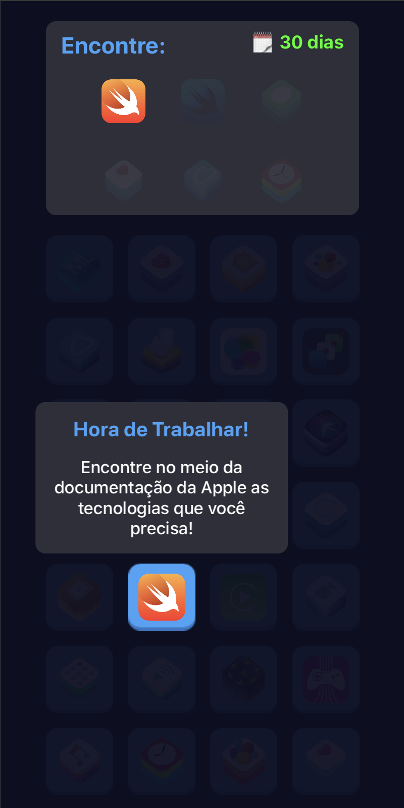

# Mr. Programmer

   

## Introdução
Mr. Programmer é uma cena interativa que tem por objetivo colocar a pessoa que está interagindo com ela na pele de um desenvolvedor de software (papel que eu amo assumir e que executo ele na maior parte meu tempo). Estudar novas tecnologias, lidar com desafios e principalmente superar desafios. Nesse projeto você vai encontrar um pouco disso tudo.

Esse projeto foi criado para ser enviado para a WWDC Scholarships de 2020, muito embora a conferência tenha sofrido algumas modificações na edição desse ano.

## Como jogar?
Toque nós ícones das tecnologias que você precisa para o seu projeto antes que o prazo estipulado pelo cliente acabe.

## Tecnologias utilizadas
- Um dos grandes objetivos que eu tinha durante a construção desse projeto consistia no meu aprimoramento com UIKit. Dessa forma, eu me desafiei a criar uma espécie de jogo em cima desse framework.

- Outra habilidade que eu desejava aprimorar era o Auto Layout. Portanto, todo o criação de constraints para ajustar os itens na tela foi feito programaticamente, isto é, sem o uso de Storyboards/Interface Builder.

- O padrão arquitetural utilizado no projeto foi o MVC.

- A exibição dos elementos em lista (ícones das tecnologias nas mais diversas telas do projeto) foi estruturada utilizando Collection Views.

## Licença
Esse projeto está licenciado sob a licença MIT license. Veja o arquivo [LICENSE](https://github.com/isnardsilva/MrProgrammerWWDC/blob/master/LICENSE) para ter mais informações.